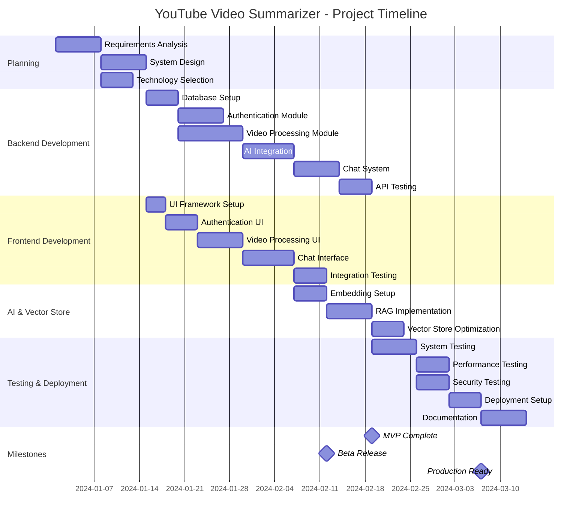

# Chapter 2 – System Planning

## 2.1 Project Development Approach

### 2.1.1 Software Development Life Cycle (SDLC) Model

For the YouTube Video Summarizer System, we have adopted the **Agile Development Model** with elements of the **Iterative and Incremental Model**. This hybrid approach was selected based on the following considerations:

#### Reasons for Choosing Agile Methodology:

1. **Flexibility**: The project requirements evolved as we gained deeper understanding of AI integration complexities
2. **User Feedback**: Early prototypes allowed for continuous user feedback and requirement refinement
3. **Technology Integration**: Complex AI and modern web technologies required iterative testing and validation
4. **Risk Management**: Incremental development helped identify and mitigate technical risks early
5. **Team Collaboration**: Enhanced communication between frontend, backend, and AI integration teams

#### SDLC Phases Implementation:

1. **Planning Phase** (Week 1-2):

   - Requirements gathering and analysis
   - Technology stack selection
   - System architecture design
   - Project timeline establishment

2. **Design Phase** (Week 3-4):

   - Database schema design
   - API specification development
   - UI/UX wireframe creation
   - Security architecture planning

3. **Implementation Phase** (Week 5-12):

   - Sprint 1: User authentication and basic video processing
   - Sprint 2: AI integration and summarization features
   - Sprint 3: Chat system and RAG implementation
   - Sprint 4: Frontend development and UI integration

4. **Testing Phase** (Week 13-14):

   - Unit testing for individual components
   - Integration testing for API endpoints
   - User acceptance testing
   - Performance and security testing

5. **Deployment Phase** (Week 15-16):
   - Production environment setup
   - System deployment and monitoring
   - Documentation completion
   - User training and support

## 2.2 System Modules

### 2.2.1 Authentication Module

**Purpose**: Manages user registration, login, and session management with secure authentication mechanisms.

**Key Components**:

- User registration with email verification
- JWT-based authentication system
- Password encryption using bcrypt
- Session management and token refresh
- OAuth integration capabilities

**Technologies**: FastAPI, PyJWT, Passlib, MongoDB

### 2.2.2 Video Processing Module

**Purpose**: Handles YouTube video information extraction, transcript fetching, and metadata processing.

**Key Components**:

- YouTube URL validation and parsing
- Video metadata extraction (title, description, duration, thumbnails)
- Transcript fetching in multiple languages
- Background task processing with worker queues
- Error handling and retry mechanisms

**Technologies**: yt-dlp, youtube-transcript-api, AsyncIO, Motor

### 2.2.3 AI Analysis Module

**Purpose**: Provides intelligent content analysis, summarization, and natural language understanding capabilities.

**Key Components**:

- Google Gemini 2.0 Flash integration
- Text preprocessing and language detection
- Content summarization algorithms
- Vector embedding generation
- Multilingual text processing

**Technologies**: Google GenerativeAI, LangChain, ChromaDB, LangDetect

### 2.2.4 Vector Storage Module

**Purpose**: Manages document embeddings, similarity search, and vector-based content retrieval.

**Key Components**:

- Document embedding generation
- Vector database management
- Similarity search algorithms
- Metadata indexing and filtering
- Performance optimization for large datasets

**Technologies**: ChromaDB, LangChain-Chroma, Google Embeddings

### 2.2.5 Chat System Module

**Purpose**: Implements intelligent chat functionality with context-aware responses and conversation history.

**Key Components**:

- Real-time chat interface
- RAG (Retrieval Augmented Generation) implementation
- Context preservation across conversations
- Multi-turn dialogue management
- Response streaming and optimization

**Technologies**: LangChain, FastAPI WebSockets, React Chat UI

### 2.2.6 User Interface Module

**Purpose**: Provides responsive, modern web interface for user interaction and system visualization.

**Key Components**:

- Responsive design for multiple devices
- Real-time status updates
- Interactive chat interface
- Video management dashboard
- User preference settings

**Technologies**: Next.js 15, React 19, TypeScript, Tailwind CSS, Radix UI

### 2.2.7 Database Module

**Purpose**: Manages data persistence, user information, video metadata, and chat histories.

**Key Components**:

- User profile management
- Video information storage
- Chat history persistence
- Session data management
- Database indexing and optimization

**Technologies**: MongoDB, Motor (Async MongoDB driver)

## 2.3 Functional Requirements

| FR ID  | Title                        | Description                                                       | Priority | Dependencies            |
| ------ | ---------------------------- | ----------------------------------------------------------------- | -------- | ----------------------- |
| FR-001 | User Registration            | Users must be able to create accounts with email and password     | High     | Database Module         |
| FR-002 | User Authentication          | Users must be able to login and logout securely                   | High     | Authentication Module   |
| FR-003 | YouTube URL Processing       | System must accept and validate YouTube URLs                      | High     | Video Processing Module |
| FR-004 | Video Information Extraction | System must extract video metadata (title, description, duration) | High     | Video Processing Module |
| FR-005 | Transcript Fetching          | System must retrieve video transcripts in available languages     | High     | Video Processing Module |
| FR-006 | Content Summarization        | System must generate AI-powered summaries of video content        | High     | AI Analysis Module      |
| FR-007 | Interactive Chat             | Users must be able to ask questions about video content           | High     | Chat System Module      |
| FR-008 | Multilingual Support         | System must support content processing in multiple languages      | Medium   | AI Analysis Module      |
| FR-009 | Chat History                 | System must preserve chat conversations for users                 | Medium   | Database Module         |
| FR-010 | Video Library                | Users must have access to their processed videos                  | Medium   | Database Module         |
| FR-011 | Real-time Processing         | System must provide real-time status updates during processing    | Medium   | User Interface Module   |
| FR-012 | Context-Aware Responses      | Chat system must provide contextually relevant answers            | High     | Vector Storage Module   |
| FR-013 | User Preferences             | Users must be able to customize language and model preferences    | Low      | User Interface Module   |
| FR-014 | Background Processing        | System must handle video processing asynchronously                | High     | Video Processing Module |
| FR-015 | Error Handling               | System must gracefully handle errors and provide user feedback    | Medium   | All Modules             |

## 2.4 Non-Functional Requirements

### 2.4.1 Performance Requirements

| NFR ID  | Requirement           | Specification                                          | Measurement                |
| ------- | --------------------- | ------------------------------------------------------ | -------------------------- |
| NFR-001 | Response Time         | API responses within 2 seconds for standard operations | Average response time      |
| NFR-002 | Video Processing Time | Process videos up to 60 minutes within 10 minutes      | Processing completion time |
| NFR-003 | Concurrent Users      | Support minimum 100 concurrent active users            | Load testing results       |
| NFR-004 | Chat Response Time    | Chat responses within 5 seconds                        | Response latency metrics   |
| NFR-005 | System Throughput     | Process minimum 50 videos per hour                     | Processing rate            |

### 2.4.2 Security Requirements

| NFR ID  | Requirement             | Specification                                        | Implementation                             |
| ------- | ----------------------- | ---------------------------------------------------- | ------------------------------------------ |
| NFR-006 | Data Encryption         | All sensitive data encrypted in transit and at rest  | HTTPS, Database encryption                 |
| NFR-007 | Authentication Security | Secure password storage and session management       | bcrypt, JWT tokens                         |
| NFR-008 | API Security            | Rate limiting and input validation for all endpoints | FastAPI validation, rate limiting          |
| NFR-009 | User Privacy            | User data protected according to privacy standards   | Data anonymization, GDPR compliance        |
| NFR-010 | System Security         | Protection against common web vulnerabilities        | CORS, input sanitization, security headers |

### 2.4.3 Reliability Requirements

| NFR ID  | Requirement         | Specification                                 | Target                             |
| ------- | ------------------- | --------------------------------------------- | ---------------------------------- |
| NFR-011 | System Availability | 99.5% uptime during business hours            | Monitoring and alerts              |
| NFR-012 | Error Recovery      | Automatic recovery from transient failures    | Retry mechanisms, circuit breakers |
| NFR-013 | Data Consistency    | Maintain data integrity across all operations | ACID compliance, validation        |
| NFR-014 | Backup Strategy     | Regular automated backups of critical data    | Daily database backups             |

### 2.4.4 Usability Requirements

| NFR ID  | Requirement          | Specification                                                   | Validation                            |
| ------- | -------------------- | --------------------------------------------------------------- | ------------------------------------- |
| NFR-015 | User Interface       | Intuitive interface requiring minimal training                  | User testing, accessibility standards |
| NFR-016 | Mobile Compatibility | Responsive design for mobile devices                            | Cross-device testing                  |
| NFR-017 | Browser Support      | Support for modern web browsers (Chrome, Firefox, Safari, Edge) | Cross-browser testing                 |
| NFR-018 | Accessibility        | WCAG 2.1 compliance for accessibility                           | Accessibility audits                  |

### 2.4.5 Scalability Requirements

| NFR ID  | Requirement            | Specification                       | Implementation Strategy                      |
| ------- | ---------------------- | ----------------------------------- | -------------------------------------------- |
| NFR-019 | Database Scalability   | Support for horizontal scaling      | MongoDB clustering, sharding                 |
| NFR-020 | Processing Scalability | Ability to scale processing workers | Worker pool management, load balancing       |
| NFR-021 | Storage Scalability    | Efficient storage growth management | Vector database optimization, data archiving |

## 2.5 Hardware and Software Requirements

### 2.5.1 Hardware Requirements

#### Development Environment:

- **CPU**: Intel Core i5 or AMD Ryzen 5 (minimum), Intel Core i7 or AMD Ryzen 7 (recommended)
- **RAM**: 8GB (minimum), 16GB (recommended)
- **Storage**: 50GB available space (minimum), 100GB (recommended)
- **GPU**: Optional for AI model fine-tuning (NVIDIA GTX 1060 or better)

#### Production Environment:

- **CPU**: 4-core server processor (minimum), 8-core (recommended)
- **RAM**: 16GB (minimum), 32GB (recommended)
- **Storage**: 200GB SSD (minimum), 500GB SSD (recommended)
- **Network**: 1 Gbps connection with low latency
- **GPU**: Optional for enhanced AI processing

### 2.5.2 Software Requirements

#### Development Tools:

- **Operating System**: Windows 10/11, macOS 10.15+, or Ubuntu 20.04+
- **Python**: 3.12+ with pip package manager
- **Node.js**: 18+ with npm/pnpm package manager
- **Database**: MongoDB 6.0+, ChromaDB
- **IDE**: Visual Studio Code, PyCharm, or similar
- **Version Control**: Git with GitHub integration

#### Runtime Dependencies:

- **Backend**: FastAPI, uvicorn, motor, pydantic, langchain
- **Frontend**: Next.js 15, React 19, TypeScript, Tailwind CSS
- **AI Services**: Google GenerativeAI, youtube-transcript-api, yt-dlp
- **Database**: MongoDB, ChromaDB, pymongo

#### Third-Party Services:

- **AI Provider**: Google AI Platform (Gemini models)
- **Authentication**: JWT tokens, bcrypt
- **Deployment**: Docker (optional), cloud hosting platforms

## 2.6 Timeline Chart (Gantt Chart)

### 2.6.1 Phase Breakdown

#### Phase 1: Foundation (Weeks 1-4)

- Project planning and requirements analysis
- System architecture design
- Development environment setup
- Database schema design and implementation

#### Phase 2: Backend Core (Weeks 5-8)

- Authentication system implementation
- Video processing module development
- AI service integration
- API endpoint creation and testing

#### Phase 3: Frontend Development (Weeks 6-10)

- User interface design and implementation
- Authentication flow integration
- Video processing interface
- Chat system user interface

#### Phase 4: AI Enhancement (Weeks 9-11)

- Vector storage optimization
- RAG system implementation
- Chat intelligence enhancement
- Performance optimization

#### Phase 5: Integration & Testing (Weeks 12-15)

- System integration testing
- User acceptance testing
- Performance and security testing
- Bug fixes and optimization

#### Phase 6: Deployment & Documentation (Weeks 16-17)

- Production environment setup
- System deployment
- Documentation completion
- User training materials

### 2.6.2 Critical Path Analysis

**Critical Path**: Requirements → Database Setup → Video Processing → AI Integration → Chat System → System Testing → Deployment

**Key Dependencies**:

1. Database setup is prerequisite for all data-dependent modules
2. AI integration depends on video processing completion
3. Chat system requires both AI integration and vector storage
4. Frontend development can proceed parallel to backend after API specification
5. Testing phases require completion of corresponding development phases

**Risk Mitigation**:

- Buffer time allocated for AI integration challenges
- Parallel development streams to minimize dependencies
- Regular integration testing to identify issues early
- Contingency plans for third-party service limitations
