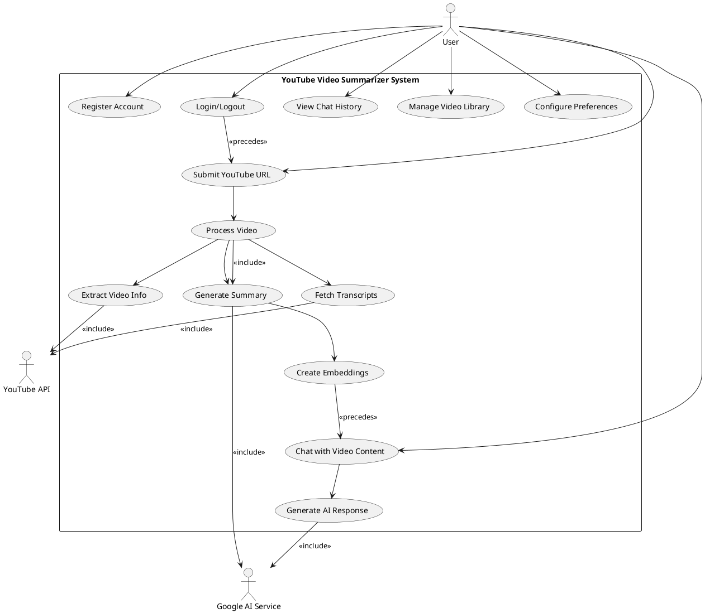
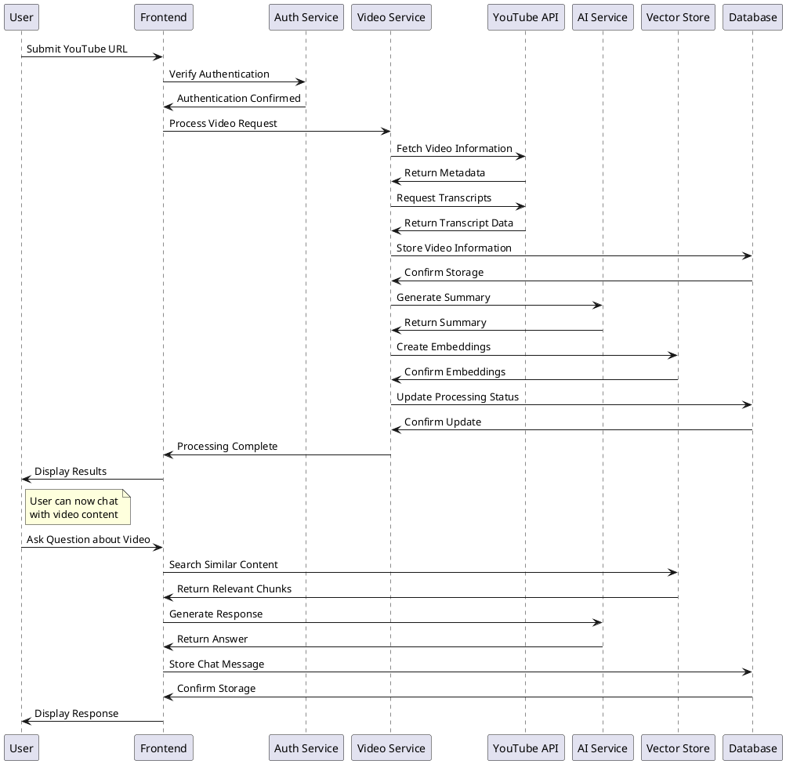
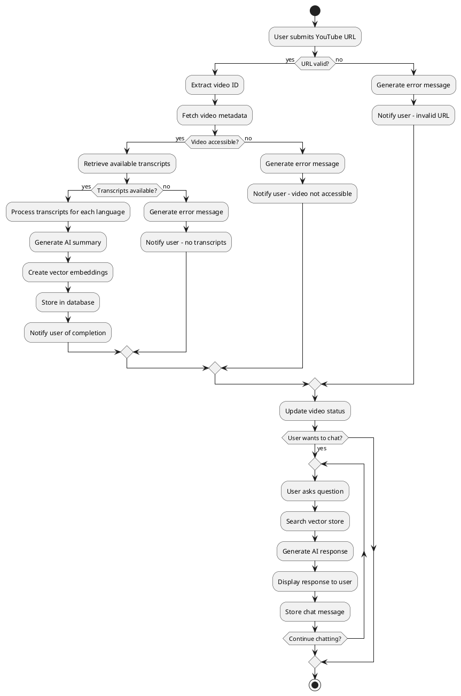
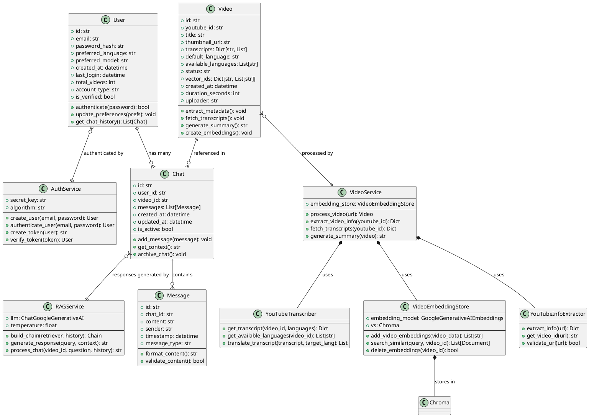
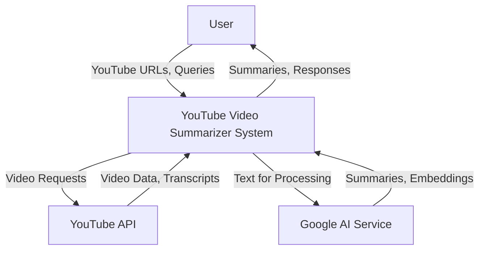
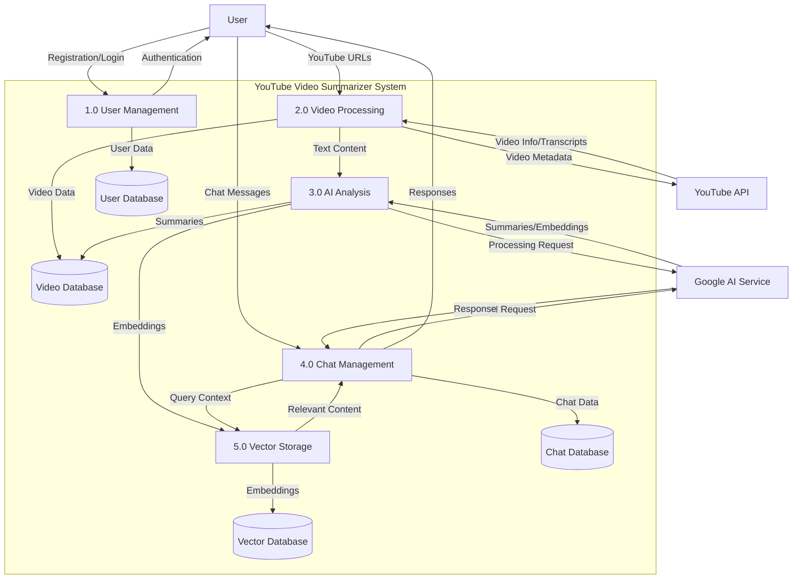
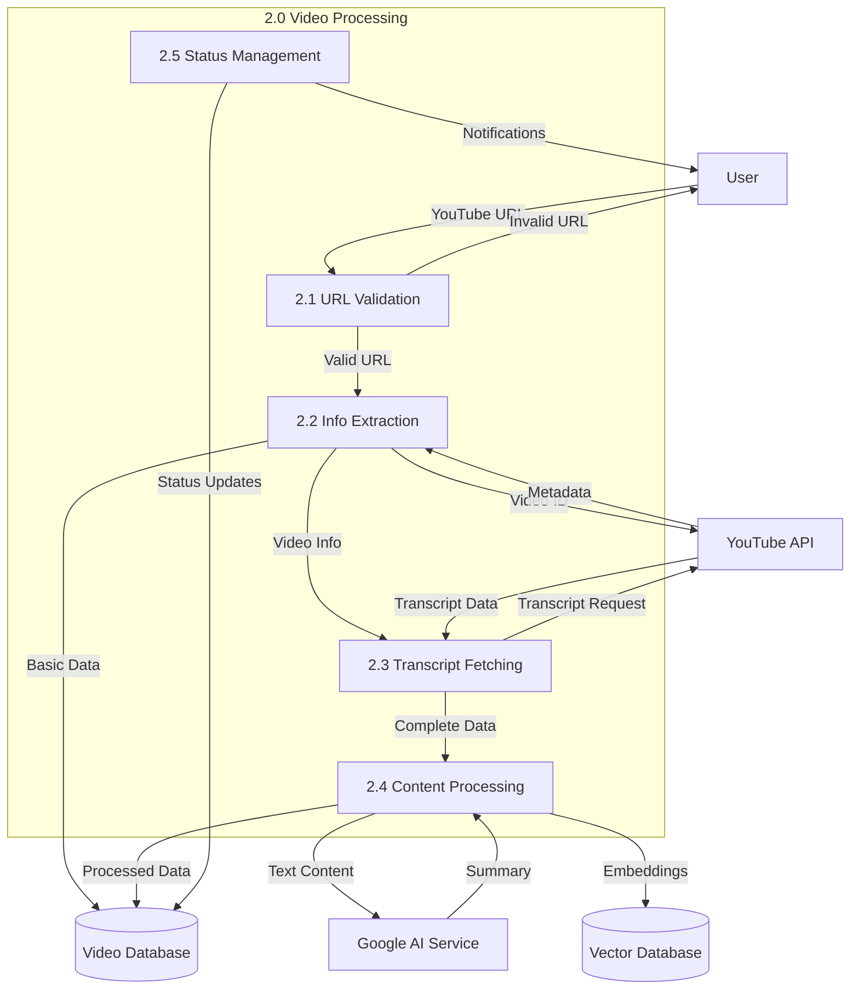
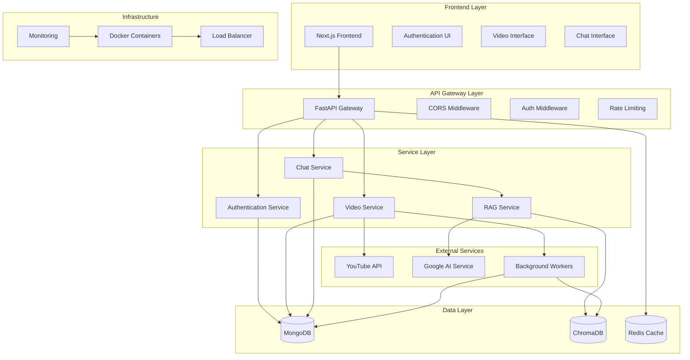
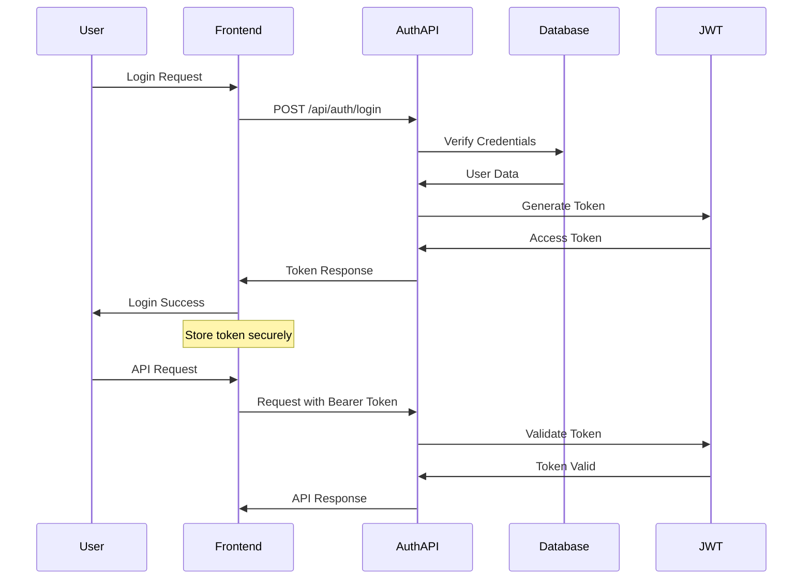
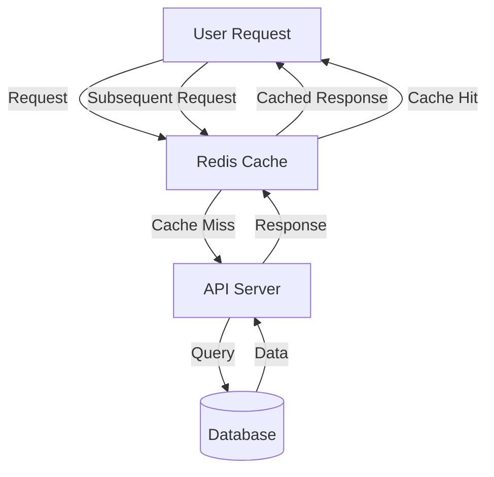

# Chapter 3 – System Design

## 3.1 Use Case Diagram



### 3.1.1 Use Case Descriptions

| Use Case ID | Use Case Name           | Description                                        | Actors             | Preconditions       |
| ----------- | ----------------------- | -------------------------------------------------- | ------------------ | ------------------- |
| UC1         | Register Account        | User creates a new account with email and password | User               | None                |
| UC2         | Login/Logout            | User authenticates and manages session             | User               | Account exists      |
| UC3         | Submit YouTube URL      | User provides YouTube video URL for processing     | User               | User logged in      |
| UC4         | Process Video           | System processes video information and transcripts | System             | Valid URL provided  |
| UC5         | Generate Summary        | System creates AI-powered summary of video content | System, AI Service | Video processed     |
| UC6         | Chat with Video Content | User asks questions about video content            | User, AI Service   | Summary available   |
| UC7         | View Chat History       | User accesses previous conversations               | User               | Chat history exists |
| UC8         | Manage Video Library    | User views and manages processed videos            | User               | User logged in      |
| UC9         | Configure Preferences   | User sets language and model preferences           | User               | User logged in      |

## 3.2 Sequence Diagram



## 3.3 Activity Diagram



## 3.4 Class Diagram



## 3.5 Database Schema

### 3.5.1 MongoDB Collections

#### Users Collection

```javascript
{
  "_id": ObjectId,
  "email": String, // Unique index
  "password_hash": String,
  "preferred_language": String, // Default: "en"
  "preferred_model": String, // Default: "gemini-2.0-flash"
  "profile": {
    "display_name": String,
    "bio": String,
    "avatar_url": String,
    "timezone": String,
    "notification_settings": Object
  },
  "created_at": ISODate,
  "last_login": ISODate,
  "total_videos": Number, // Default: 0
  "account_type": String, // Default: "free"
  "is_verified": Boolean // Default: false
}
```

#### Videos Collection

```javascript
{
  "_id": ObjectId,
  "youtube_id": String, // Unique index
  "title": String,
  "description": String,
  "thumbnail_url": String,
  "duration_seconds": Number,
  "view_count": Number,
  "uploader": String,
  "channel_url": String,
  "transcripts": {
    "en": [
      {
        "text": String,
        "start": Number,
        "duration": Number
      }
    ],
    "es": [...],
    // More languages
  },
  "default_language": String,
  "available_languages": [String],
  "status": String, // "pending", "processing", "completed", "failed"
  "processing_error": String,
  "vector_ids": {
    "en": [String], // ChromaDB document IDs
    "es": [String],
    // More languages
  },
  "created_at": ISODate,
  "updated_at": ISODate,
  "processed_at": ISODate
}
```

#### Chats Collection

```javascript
{
  "_id": ObjectId,
  "user_id": ObjectId, // Reference to Users collection
  "video_id": ObjectId, // Reference to Videos collection
  "title": String,
  "messages": [
    {
      "id": String,
      "content": String,
      "sender": String, // "user" or "assistant"
      "timestamp": ISODate,
      "message_type": String // "text", "summary", "error"
    }
  ],
  "created_at": ISODate,
  "updated_at": ISODate,
  "is_active": Boolean,
  "language": String
}
```

#### Video User Uploads Collection

```javascript
{
  "_id": ObjectId,
  "user_id": ObjectId, // Reference to Users collection
  "video_id": ObjectId, // Reference to Videos collection
  "uploaded_at": ISODate
}
```

### 3.5.2 ChromaDB Collections

#### Video Embeddings Collection

```python
{
  "id": "youtube_id_chunk_index_lang", # Unique document ID
  "embedding": [float], # 768-dimensional vector
  "metadata": {
    "youtube_id": str,
    "lang": str,
    "field": str, # "title", "description", "transcript"
    "chunk_index": int,
    "start_time": float, # For transcript chunks
    "end_time": float,   # For transcript chunks
    "content_type": str  # "metadata" or "transcript"
  },
  "document": str # Original text content
}
```

### 3.5.3 Database Indexes

#### MongoDB Indexes

```javascript
// Users Collection
db.users.createIndex({ email: 1 }, { unique: true });
db.users.createIndex({ created_at: 1 });

// Videos Collection
db.videos.createIndex({ youtube_id: 1 }, { unique: true });
db.videos.createIndex({ status: 1 });
db.videos.createIndex({ created_at: 1 });
db.videos.createIndex({ uploader: 1 });

// Chats Collection
db.chats.createIndex({ user_id: 1 });
db.chats.createIndex({ video_id: 1 });
db.chats.createIndex({ user_id: 1, video_id: 1 });
db.chats.createIndex({ created_at: 1 });

// Video User Uploads Collection
db.video_user_uploads.createIndex({ user_id: 1 });
db.video_user_uploads.createIndex({ video_id: 1 });
db.video_user_uploads.createIndex({ user_id: 1, uploaded_at: 1 });
```

## 3.6 Data Flow Diagrams

### 3.6.1 DFD Level 0 (Context Diagram)



### 3.6.2 DFD Level 1 (Major Processes)



### 3.6.3 DFD Level 2 (Video Processing Detail)



## 3.7 System Architecture Diagram



## 3.8 Security Architecture

### 3.8.1 Authentication Flow



### 3.8.2 Security Measures

| Layer            | Security Measure   | Implementation                        |
| ---------------- | ------------------ | ------------------------------------- |
| Transport        | HTTPS/TLS 1.3      | SSL certificates, secure headers      |
| Authentication   | JWT + bcrypt       | Token-based auth, password hashing    |
| Authorization    | Role-based access  | User permissions, resource protection |
| Input Validation | Pydantic models    | Request/response validation           |
| Rate Limiting    | Token bucket       | API endpoint protection               |
| Data Protection  | Encryption at rest | Database encryption, secure storage   |
| Monitoring       | Audit logging      | Security event tracking               |
| CORS             | Origin control     | Cross-origin request management       |

## 3.9 Performance Architecture

### 3.9.1 Caching Strategy



### 3.9.2 Scalability Design

| Component          | Scaling Strategy    | Implementation                    |
| ------------------ | ------------------- | --------------------------------- |
| API Server         | Horizontal scaling  | Load balancer, multiple instances |
| Database           | Sharding/Clustering | MongoDB replica sets              |
| Vector Store       | Distributed storage | ChromaDB clustering               |
| Background Workers | Queue-based scaling | Worker pool management            |
| Frontend           | CDN distribution    | Static asset caching              |
| AI Processing      | Batch processing    | Asynchronous task queues          |
