# Chapter 3 – System Design

## 3.1 Use Case Diagrams

### 3.1.1 User Authentication Use Cases

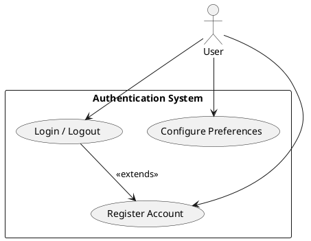

### 3.1.2 Video Processing Use Cases

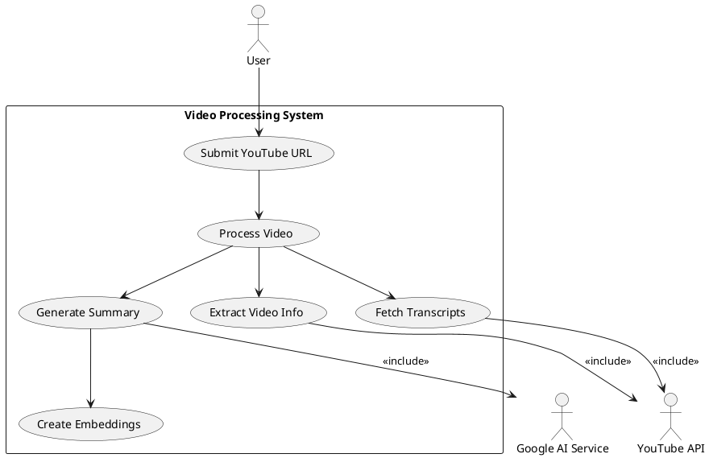

### 3.1.3 Chat and Library Management Use Cases

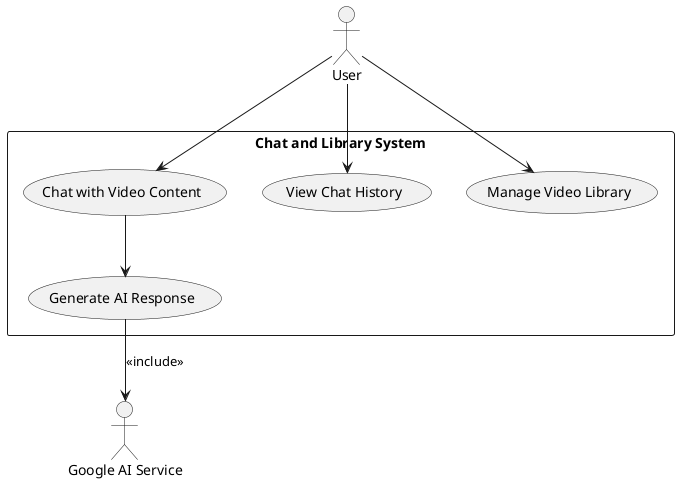

### 3.1.4 Use Case Descriptions

| Use Case ID | Use Case Name           | Description                                        | Actors             | Preconditions       |
| ----------- | ----------------------- | -------------------------------------------------- | ------------------ | ------------------- |
| UC1         | Register Account        | User creates a new account with email and password | User               | None                |
| UC2         | Login/Logout            | User authenticates and manages session             | User               | Account exists      |
| UC3         | Submit YouTube URL      | User provides YouTube video URL for processing     | User               | User logged in      |
| UC4         | Process Video           | System processes video information and transcripts | System             | Valid URL provided  |
| UC5         | Generate Summary        | System creates AI-powered summary of video content | System, AI Service | Video processed     |
| UC6         | Chat with Video Content | User asks questions about video content            | User, AI Service   | Summary available   |
| UC7         | View Chat History       | User accesses previous conversations               | User               | Chat history exists |
| UC8         | Manage Video Library    | User views and manages processed videos            | User               | User logged in      |
| UC9         | Configure Preferences   | User sets language and model preferences           | User               | User logged in      |

## 3.2 Sequence Diagrams

### 3.2.1 Video Processing Sequence

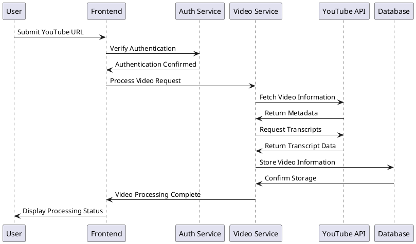

### 3.2.2 AI Processing Sequence

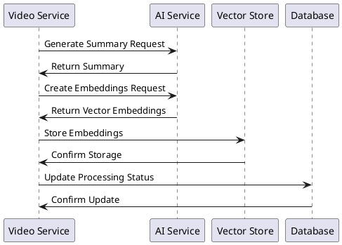

### 3.2.3 Chat Interaction Sequence

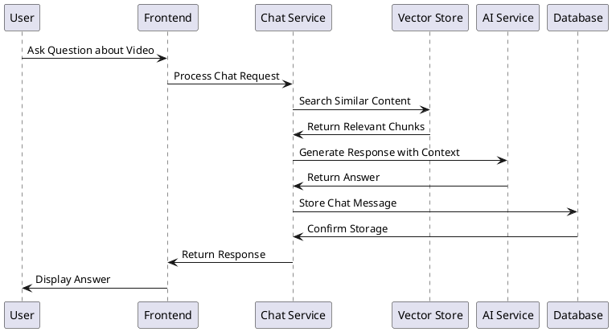

## 3.3 Activity Diagrams

### 3.3.1 Video Submission and Validation Activity

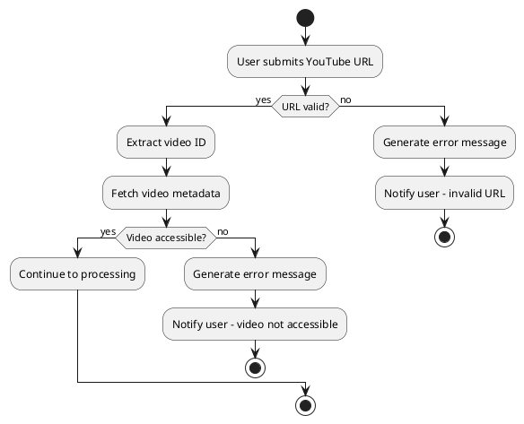

### 3.3.2 Video Processing Activity

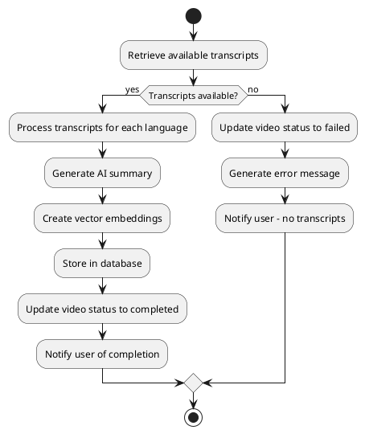

### 3.3.3 Chat Interaction Activity

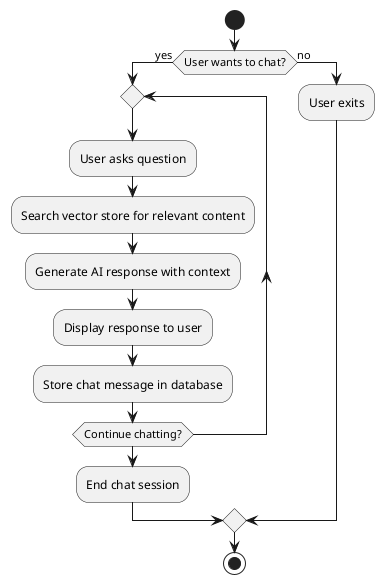

## 3.4 Class Diagram

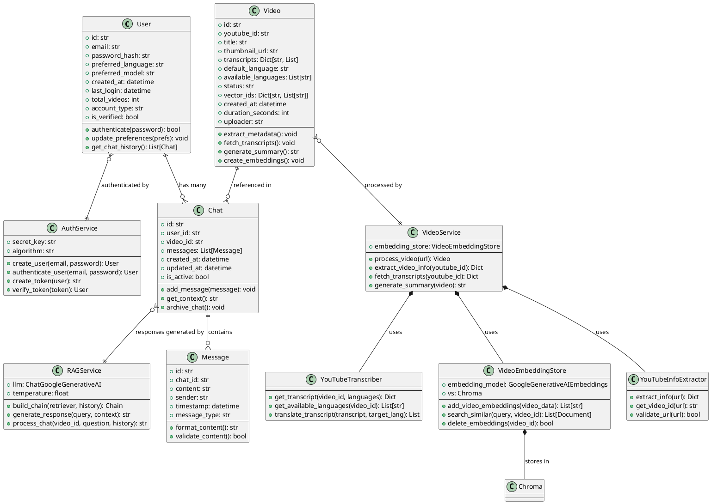

Perfect 👍 To build the **Data Dictionary** from your schema, we’ll list each collection, its fields, data type, description, constraints (like _unique, default, reference_), and possible values.

Here’s a full **Data Dictionary** for your system:

---

# 3.5 📘 Data Dictionary

## 3.5.1 MongoDB Collections

---

### **3.5.1.1 Users Collection**

| Field                           | Data Type | Description                                          | Constraints / Default         |
| ------------------------------- | --------- | ---------------------------------------------------- | ----------------------------- |
| `_id`                           | ObjectId  | Unique identifier for each user                      | Auto-generated                |
| `email`                         | String    | User’s email                                         | Unique, required              |
| `password_hash`                 | String    | Hashed password                                      | Required                      |
| `preferred_language`            | String    | User’s preferred language for transcripts/chat       | Default: `"en"`               |
| `preferred_model`               | String    | Preferred AI model                                   | Default: `"gemini-2.0-flash"` |
| `profile.display_name`          | String    | User’s display name                                  | Optional                      |
| `profile.bio`                   | String    | Short bio                                            | Optional                      |
| `profile.avatar_url`            | String    | Profile picture URL                                  | Optional                      |
| `profile.timezone`              | String    | User’s timezone                                      | Optional                      |
| `profile.notification_settings` | Object    | User’s notification preferences                      | Optional                      |
| `created_at`                    | ISODate   | Account creation timestamp                           | Auto-set                      |
| `last_login`                    | ISODate   | Last login timestamp                                 | Updated per login             |
| `total_videos`                  | Number    | Number of videos processed by user                   | Default: 0                    |
| `account_type`                  | String    | Account type (`"free"`, `"premium"`, `"enterprise"`) | Default: `"free"`             |
| `is_verified`                   | Boolean   | Email verification status                            | Default: `false`              |

---

### **3.5.1.2 Videos Collection**

| Field                 | Data Type | Description                                                                      | Constraints / Default |
| --------------------- | --------- | -------------------------------------------------------------------------------- | --------------------- |
| `_id`                 | ObjectId  | Unique identifier for each video                                                 | Auto-generated        |
| `youtube_id`          | String    | YouTube video ID                                                                 | Unique, required      |
| `title`               | String    | Video title                                                                      | Required              |
| `description`         | String    | Video description                                                                | Optional              |
| `thumbnail_url`       | String    | URL of video thumbnail                                                           | Optional              |
| `duration_seconds`    | Number    | Video duration in seconds                                                        | Optional              |
| `view_count`          | Number    | YouTube view count at processing                                                 | Optional              |
| `uploader`            | String    | Uploader’s name                                                                  | Optional              |
| `channel_url`         | String    | YouTube channel URL                                                              | Optional              |
| `transcripts`         | Object    | Transcript data in multiple languages                                            | Key = language code   |
| `default_language`    | String    | Primary transcript language                                                      | Required              |
| `available_languages` | [String]  | List of supported languages                                                      | Optional              |
| `status`              | String    | Video processing status (`"pending"`, `"processing"`, `"completed"`, `"failed"`) | Default: `"pending"`  |
| `processing_error`    | String    | Error details if failed                                                          | Optional              |
| `vector_ids`          | Object    | Mapping of language → vector IDs in ChromaDB                                     | Optional              |
| `created_at`          | ISODate   | Video submission timestamp                                                       | Auto-set              |
| `updated_at`          | ISODate   | Last updated timestamp                                                           | Auto-set              |
| `processed_at`        | ISODate   | When processing finished                                                         | Optional              |

---

### **3.5.1.3 Chats Collection**

| Field                     | Data Type | Description                        | Constraints / Default |
| ------------------------- | --------- | ---------------------------------- | --------------------- |
| `_id`                     | ObjectId  | Unique chat ID                     | Auto-generated        |
| `user_id`                 | ObjectId  | Reference to **Users** collection  | Required              |
| `video_id`                | ObjectId  | Reference to **Videos** collection | Required              |
| `title`                   | String    | Chat session title                 | Optional              |
| `messages[].id`           | String    | Unique message ID                  | Required              |
| `messages[].content`      | String    | Message text                       | Required              |
| `messages[].sender`       | String    | `"user"` or `"assistant"`          | Required              |
| `messages[].timestamp`    | ISODate   | When the message was sent          | Auto-set              |
| `messages[].message_type` | String    | `"text"`, `"summary"`, `"error"`   | Required              |
| `created_at`              | ISODate   | Chat creation timestamp            | Auto-set              |
| `updated_at`              | ISODate   | Last updated timestamp             | Auto-set              |
| `is_active`               | Boolean   | Chat active/inactive               | Default: `true`       |
| `language`                | String    | Chat language                      | Default: `"en"`       |

---

### **3.5.1.4 Video User Uploads Collection**

| Field         | Data Type | Description                        | Constraints / Default |
| ------------- | --------- | ---------------------------------- | --------------------- |
| `_id`         | ObjectId  | Unique ID for upload record        | Auto-generated        |
| `user_id`     | ObjectId  | Reference to **Users** collection  | Required              |
| `video_id`    | ObjectId  | Reference to **Videos** collection | Required              |
| `uploaded_at` | ISODate   | Timestamp of upload                | Auto-set              |

---

## 3.5.2 ChromaDB Collections

---

### **3.5.2.1 Video Embeddings Collection**

| Field                   | Data Type | Description                                             | Constraints / Default |
| ----------------------- | --------- | ------------------------------------------------------- | --------------------- |
| `id`                    | String    | Unique embedding ID (`youtube_id_chunk_index_lang`)     | Unique, required      |
| `embedding`             | [Float]   | 768-dimensional vector                                  | Required              |
| `metadata.youtube_id`   | String    | Reference to YouTube video ID                           | Required              |
| `metadata.lang`         | String    | Language code (e.g., `"en"`, `"es"`)                    | Required              |
| `metadata.field`        | String    | Field type (`"title"`, `"description"`, `"transcript"`) | Required              |
| `metadata.chunk_index`  | Int       | Index of chunk                                          | Required              |
| `metadata.start_time`   | Float     | Start timestamp (for transcript chunks)                 | Optional              |
| `metadata.end_time`     | Float     | End timestamp (for transcript chunks)                   | Optional              |
| `metadata.content_type` | String    | `"metadata"` or `"transcript"`                          | Required              |
| `document`              | String    | Original text content                                   | Required              |

Got it! I’ll help you create a **well-documented and structured MongoDB index section** for your project, making it readable, maintainable, and professional. Here’s a polished version:

---

## 3.5.3 Database Indexes

Indexes are critical for improving query performance in MongoDB. Below is a detailed list of indexes for each collection, along with their purpose.

---

### **3.5.3.1 Users Collection**

| Index               | Type      | Purpose                                                                                                          |
| ------------------- | --------- | ---------------------------------------------------------------------------------------------------------------- |
| `{ email: 1 }`      | Unique    | Ensures that each user has a unique email and accelerates login/authentication queries.                          |
| `{ created_at: 1 }` | Ascending | Optimizes queries that sort or filter users based on creation date (e.g., reporting or user activity analytics). |

```javascript
db.users.createIndex({ email: 1 }, { unique: true });
db.users.createIndex({ created_at: 1 });
```

---

### **3.5.3.2 Videos Collection**

| Index               | Type      | Purpose                                                                                                         |
| ------------------- | --------- | --------------------------------------------------------------------------------------------------------------- |
| `{ youtube_id: 1 }` | Unique    | Guarantees that each YouTube video is stored only once. Speeds up video retrieval.                              |
| `{ status: 1 }`     | Ascending | Speeds up queries filtering videos by their processing status (`pending`, `processing`, `completed`, `failed`). |
| `{ created_at: 1 }` | Ascending | Optimizes queries sorting or filtering videos by upload date.                                                   |
| `{ uploader: 1 }`   | Ascending | Optimizes queries that fetch all videos uploaded by a particular user.                                          |

```javascript
db.videos.createIndex({ youtube_id: 1 }, { unique: true });
db.videos.createIndex({ status: 1 });
db.videos.createIndex({ created_at: 1 });
db.videos.createIndex({ uploader: 1 });
```

---

### **3.5.3.3 Chats Collection**

| Index                         | Type      | Purpose                                                                   |
| ----------------------------- | --------- | ------------------------------------------------------------------------- |
| `{ user_id: 1 }`              | Ascending | Optimizes queries fetching all chats by a specific user.                  |
| `{ video_id: 1 }`             | Ascending | Optimizes queries fetching all chats related to a specific video.         |
| `{ user_id: 1, video_id: 1 }` | Compound  | Speeds up queries fetching chats for a specific video by a specific user. |
| `{ created_at: 1 }`           | Ascending | Optimizes queries sorting chats chronologically.                          |

```javascript
db.chats.createIndex({ user_id: 1 });
db.chats.createIndex({ video_id: 1 });
db.chats.createIndex({ user_id: 1, video_id: 1 });
db.chats.createIndex({ created_at: 1 });
```

---

### **3.5.3.4 Video User Uploads Collection**

| Index                            | Type      | Purpose                                                                  |
| -------------------------------- | --------- | ------------------------------------------------------------------------ |
| `{ user_id: 1 }`                 | Ascending | Optimizes queries fetching all videos uploaded by a user.                |
| `{ video_id: 1 }`                | Ascending | Optimizes queries checking if a particular video was uploaded by a user. |
| `{ user_id: 1, uploaded_at: 1 }` | Compound  | Speeds up queries fetching a user’s uploads sorted by upload date.       |

```javascript
db.video_user_uploads.createIndex({ user_id: 1 });
db.video_user_uploads.createIndex({ video_id: 1 });
db.video_user_uploads.createIndex({ user_id: 1, uploaded_at: 1 });
```

## 3.6 Data Flow Diagrams

### 3.6.1 DFD Level 0 (Context Diagram)

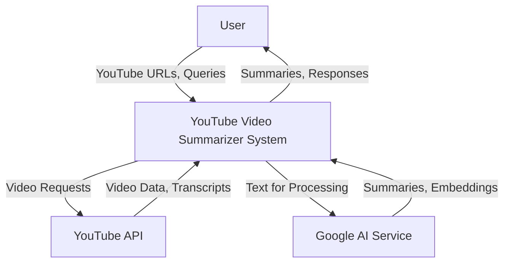

### 3.6.2 DFD Level 1 (Major Processes)

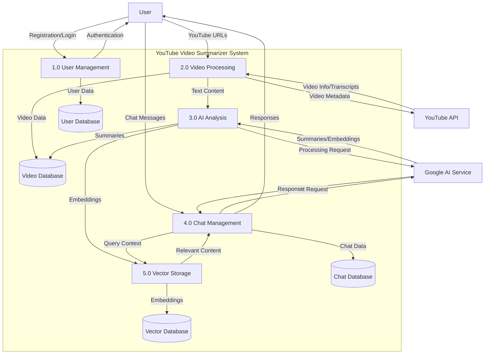

### 3.6.3 DFD Level 2 (Video Processing Detail)

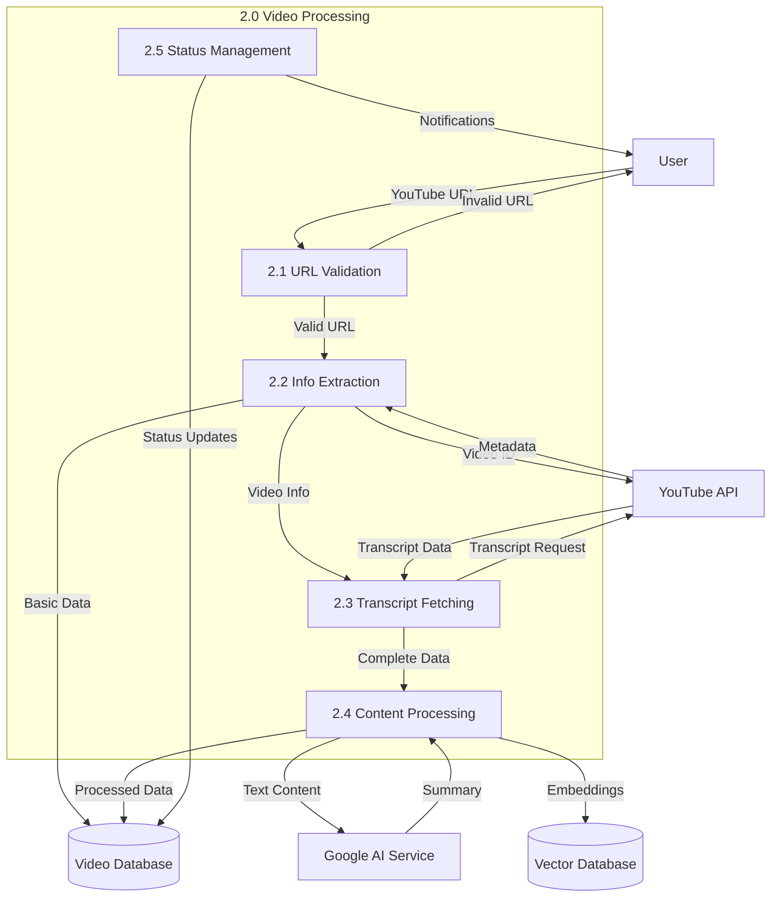

## 3.7 System Architecture Diagrams

### 3.7.1 Frontend Architecture

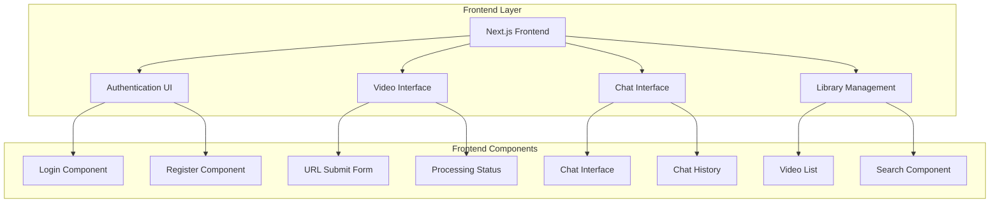

### 3.7.2 Backend Service Architecture

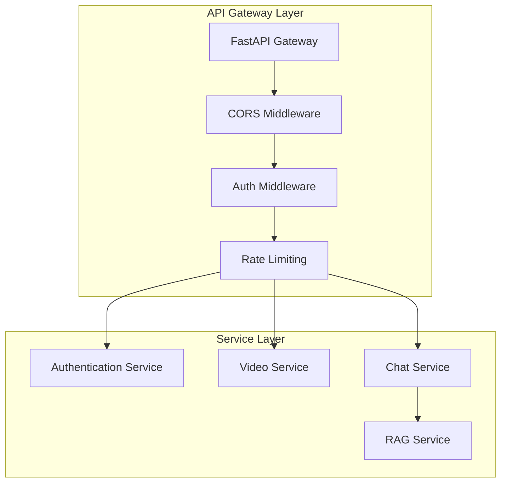

### 3.7.3 Data Layer Architecture

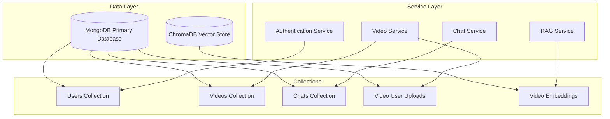

### 3.7.4 External Services Integration

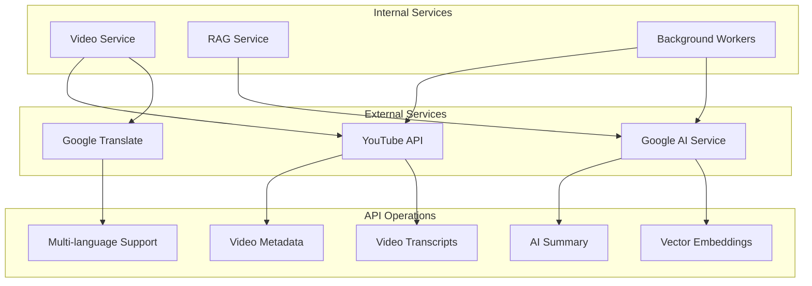

## 3.8 Security Architecture

### 3.8.1 Authentication Flow

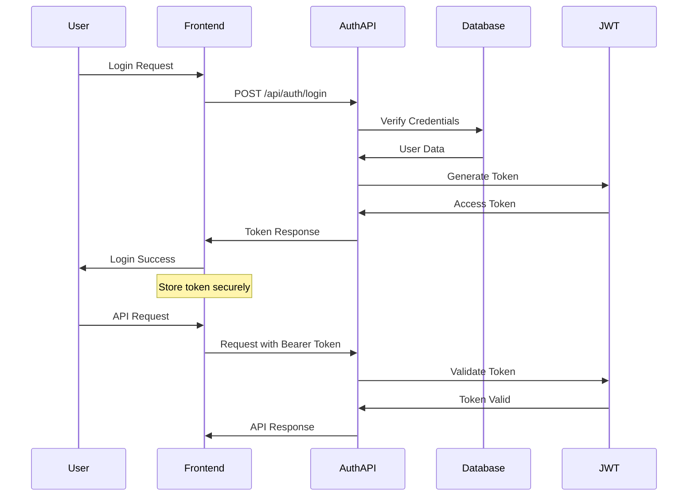

### 3.8.2 Security Measures

| Layer            | Security Measure   | Implementation                        |
| ---------------- | ------------------ | ------------------------------------- |
| Transport        | HTTPS/TLS 1.3      | SSL certificates, secure headers      |
| Authentication   | JWT + bcrypt       | Token-based auth, password hashing    |
| Authorization    | Role-based access  | User permissions, resource protection |
| Input Validation | Pydantic models    | Request/response validation           |
| Rate Limiting    | Token bucket       | API endpoint protection               |
| Data Protection  | Encryption at rest | Database encryption, secure storage   |
| Monitoring       | Audit logging      | Security event tracking               |
| CORS             | Origin control     | Cross-origin request management       |

## 3.9 Performance Architecture

### 3.9.1 Data Storage and Optimization Strategy

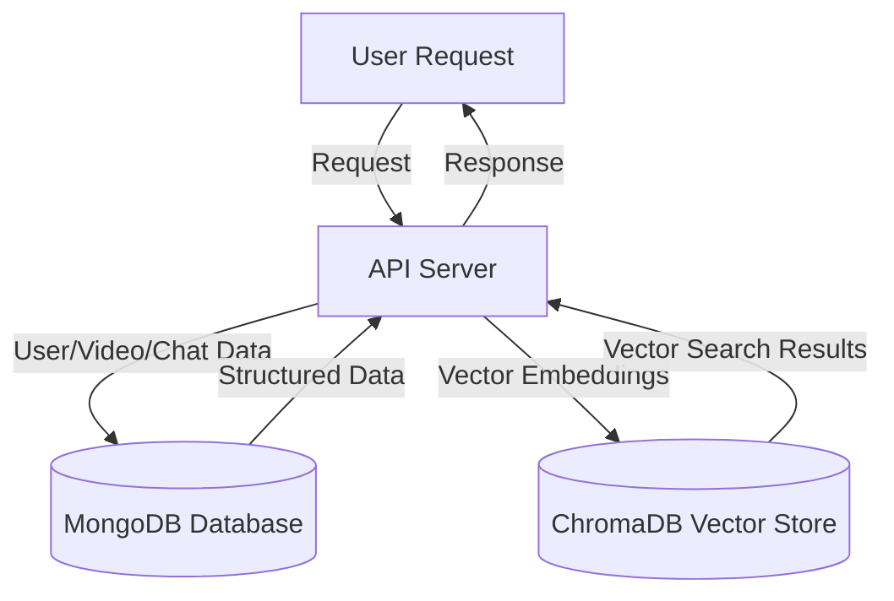

**Current Storage Architecture:**

- **MongoDB**: Primary database for users, videos, chats, and metadata
- **ChromaDB**: Vector database for embeddings and semantic search
- **Local File System**: Temporary storage for video processing
- **Memory**: In-application caching for frequently accessed data

**Optimization Strategies Implemented:**

- Database indexing for frequently queried fields
- Vector embeddings stored efficiently in ChromaDB
- Asynchronous processing for video analysis
- Connection pooling for database efficiency

### 3.9.2 Scalability Design

| Component          | Scaling Strategy      | Current Implementation                     |
| ------------------ | --------------------- | ------------------------------------------ |
| API Server         | Horizontal scaling    | FastAPI with async/await patterns          |
| MongoDB            | Replica sets/Sharding | Single instance with indexing optimization |
| ChromaDB           | Distributed storage   | Single instance with efficient embeddings  |
| Background Workers | Async task processing | Python asyncio for concurrent processing   |
| Frontend           | Static asset serving  | Next.js with optimized builds              |
| AI Processing      | Batch processing      | Queue-based video processing               |
| Vector Operations  | Optimized queries     | ChromaDB similarity search                 |

**Database Storage Details:**

**MongoDB Collections:**

- `users`: User accounts and preferences
- `videos`: Video metadata and processing status
- `chats`: Chat conversations and message history
- `video_user_uploads`: User-video relationship mapping

**ChromaDB Collections:**

- `video_embeddings`: Vector embeddings for video content
- Document structure: ID, embedding vector, metadata, original text
- Metadata includes: youtube_id, language, content_type, timestamps

**Storage Optimization:**

- MongoDB indexes on frequently queried fields (email, youtube_id, user_id)
- ChromaDB uses efficient vector similarity search algorithms
- Text chunking for optimal embedding size and retrieval accuracy

## 3.10 Actual Implementation Summary

### 3.10.1 Technology Stack Verification

**Backend Technologies:**

- **FastAPI**: RESTful API server with async support
- **Python 3.12**: Runtime environment
- **Motor**: Async MongoDB driver
- **PyMongo**: MongoDB operations
- **Pydantic**: Data validation and serialization

**Database Technologies:**

- **MongoDB**: Primary database for structured data
  - Collections: users, videos, chats, video_user_uploads
  - Async operations with Motor driver
  - Indexes for performance optimization
- **ChromaDB**: Vector database for embeddings
  - Stores video content embeddings
  - Supports semantic similarity search
  - Integrated with LangChain framework

**AI and ML Technologies:**

- **Google Generative AI**: Primary LLM (Gemini 2.0 Flash)
- **LangChain**: Framework for AI application development
- **LangChain-Google-GenAI**: Google AI integration
- **LangChain-Chroma**: ChromaDB integration
- **LangChain-Community**: Additional tools and utilities

**External APIs:**

- **YouTube Transcript API**: Fetching video transcripts
- **YT-DLP**: Video metadata extraction
- **Google Cloud Translate**: Multilingual support

### 3.10.2 Data Flow Implementation

**Video Processing Flow:**

1. User submits YouTube URL via FastAPI endpoint
2. YT-DLP extracts video metadata
3. YouTube Transcript API fetches transcripts
4. Video data stored in MongoDB videos collection
5. Text chunks created and embedded using Google AI
6. Vector embeddings stored in ChromaDB
7. Video processing status updated in MongoDB

**Chat Processing Flow:**

1. User sends chat message via FastAPI endpoint
2. RAG service retrieves relevant video context from ChromaDB
3. Google Gemini AI generates contextual response
4. Chat message and response stored in MongoDB chats collection
5. Real-time response sent back to frontend

**Authentication Flow:**

1. User credentials validated against MongoDB users collection
2. JWT tokens generated using python-jose library
3. Secure password hashing with passlib and bcrypt
4. Session management through HTTP-only cookies

### 3.10.3 Performance Characteristics

**Current Limitations:**

- No external caching layer (Redis not implemented)
- Single-instance deployment for both databases
- Synchronous video processing (no dedicated queue system)
- In-memory temporary storage during processing

**Optimization Opportunities:**

- Implement Redis for session and query caching
- Add background task queue (Celery/RQ) for video processing
- Database replication for improved read performance
- CDN integration for static asset delivery

---

_This system design document reflects the actual implementation as of September 2025, ensuring accuracy between documentation and deployed system architecture._
